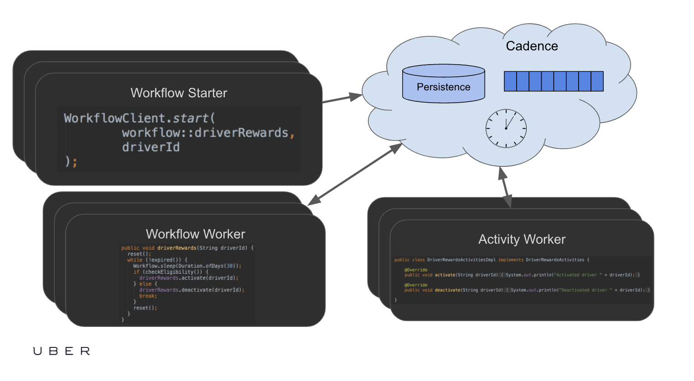
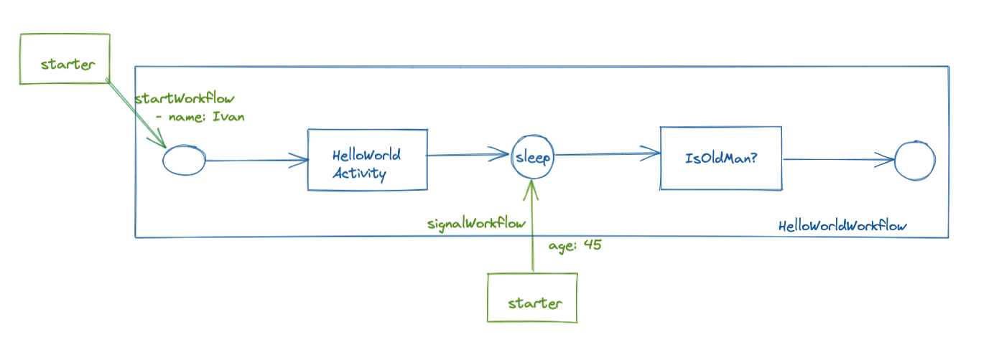
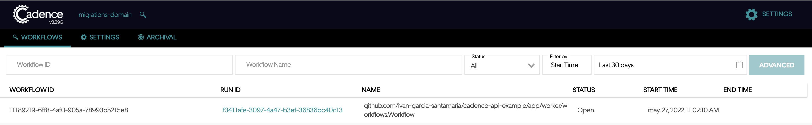
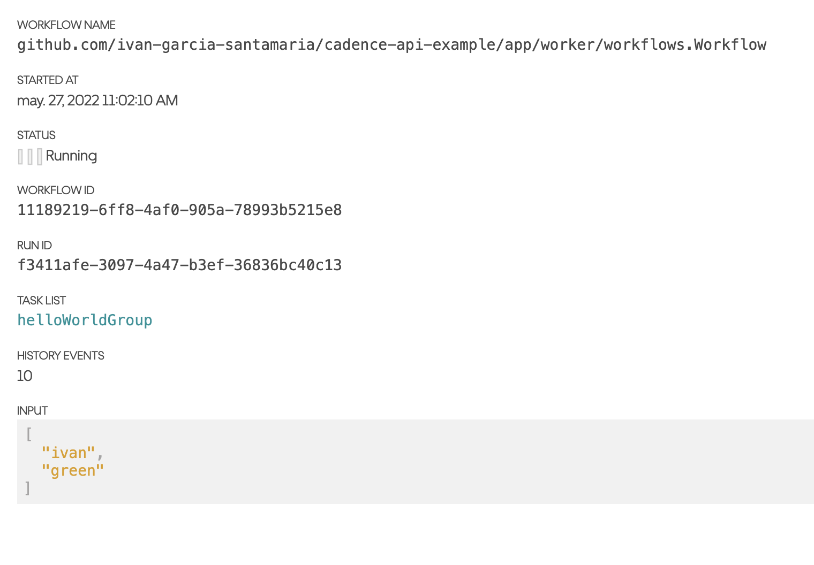
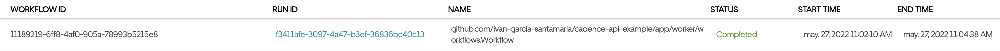
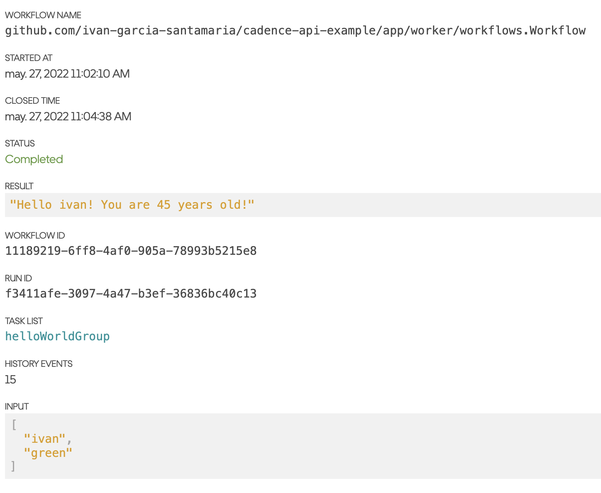

# Cadence example

# Overview

This example is the evolution of the article [Building your first Cadence Workflow](https://medium.com/stashaway-engineering/building-your-first-cadence-workflow-e61a0b29785). 

In this example, we have separated the worflow and the activity into separate deployments.



_Figure 1: Deployment diagram_


If you want to run more than one instance of workers, you can do so. Both of the worker that handles the workflow and the worker that handles the activity. If you do so, you will see how the requests are handled by the instances

In addition, it is shown how to interact with Cadence with the thrift protocol (port 7933) or with grpc (port 7833).

# Setup Environment

## Cadence Server installation and run
- Follow the steps: https://cadenceworkflow.io/docs/get-started/installation/#install-docker

## Register the domain
- Register the `migrations-domain ` with `docker run --platform linux/amd64 --network=host --rm ubercadence/cli:master --do migrations-domain domain register -rd 1`

# Workflow

This workflow example consists of two parts:

- One where you start a new workflow, where you have to give it your name. The workflow will register the name through the activity and wait.

- The second part, a signal will be sent to indicate the years you have and the workflow will end.



If you enter the [Cadence console](http://localhost:8088/) between step 1 and step 2, the workflow goes from "Open/Running" to "Completed".


# Workers
We have made two workers, one to handle the workflow and one to handle the activity.

By separating them we have two independent systems that interact with Cadence in the same domain.

## Worker for workflow
This worker interacts with Cadence through GRPC, port 7833

To start the worker:
```
cd app/worker
go run main.go
```

## Worker for activity
This worker interacts with Cadence through Thrift, port 7933

To start the worker:
```
cd app/worker-activity
go run main.go
```

# Starter
To launch the workflow, the server that implements the launch and completion endpoints must be up and running.

To start the server:
```
cd app/httpserver
go run main.go
```
## Endpoints

There are two endpoints
- /api/start-hello-world. With which a new workflow with your name is created. For this you have to make the following request:

```
curl --location --request POST 'http://localhost:3030/api/start-hello-world?name=ivan'
```
And you will get something like this as an answer:
```
{
    "ID": "11189219-6ff8-4af0-905a-78993b5215e8",
    "RunID": "f3411afe-3097-4a47-b3ef-36836bc40c13"
}
```
Where ID is the `workflowId` created in Cadence and you can use it to signal in the next step

In the [Cadence console](http://localhost:8088/) you will see something like this:



And in the details:



- /api/signal-hello-world. With which a signal is sent indicating how old you are.

```
curl --location --request POST 'http://localhost:3030/api/signal-hello-world?workflowId={{workflowId}}&age=45'
```
Where `workflowId` is the workflowID value created in the previous step. You can also view this value in the [Cadence console](http://localhost:8088/).

In the [Cadence console](http://localhost:8088/) you will see something like this:



And in the details:



# How to run
1. Start the worker with the [workflow](#worker-for-workflow)
2. Start the worker with the [activity](#worker-for-activity)
3. Start the [starter](#starter)
4. Make request like [this](#endpoints)